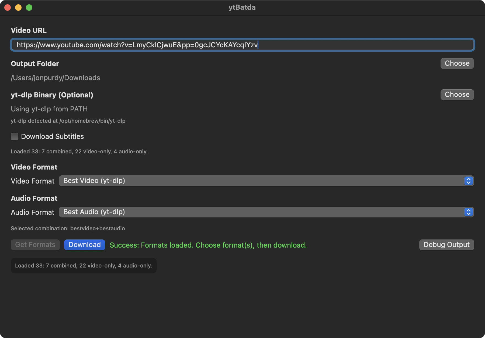

# ytBatda

batda (받다) == to receive (Korean)

Minimal native macOS 14+ (Sonoma+) SwiftUI frontend for `yt-dlp`.



Note: this project was vibe coded with AI using Codex.

## Architecture

- `ContentView`: UI
- `DownloadViewModel`: state + async orchestration
- `YTDLPService`: process execution + validation

## Prerequisites

- macOS 14+ (Sonoma or newer, untested with Tahoe due to Tahoe being terrible)
- Intel (`x86_64`) or Apple Silicon (`arm64`) Mac
- `yt-dlp` installed in `PATH` (or choose binary in app)
  - Auto-detected locations include Homebrew (`/opt/homebrew/bin`, `/usr/local/bin`) and MacPorts (`/opt/local/bin`)

Example install:

```bash
brew install yt-dlp
```

MacPorts:

```bash
sudo port install yt-dlp
```

## Build (Release)

```bash
./scripts/build_release_app.sh
```

This produces a double-clickable app bundle at:

- `dist/ytBatda.app`

## Run

1. Open `dist/ytBatda.app`.
2. Paste a video URL.
3. Output defaults to `~/Downloads` (or choose another folder).
4. Click **Get Formats**.
5. Pick format(s) from the dropdown menu(s).
6. Optional: enable subtitles, choose one language, and choose whether to embed.
7. Click **Download**.

`Download` currently requires fetching formats first.

## Notes

- This first step relies on an installed `yt-dlp` binary.
- Embedding `yt-dlp` inside the app can be added in a later step.
- The app bundle is currently unsigned for public distribution, so Gatekeeper may block first launch.
  - In Finder, right-click `dist/ytBatda.app` and choose **Open**, then confirm.
  - Or run:

```bash
xattr -dr com.apple.quarantine dist/ytBatda.app
```
